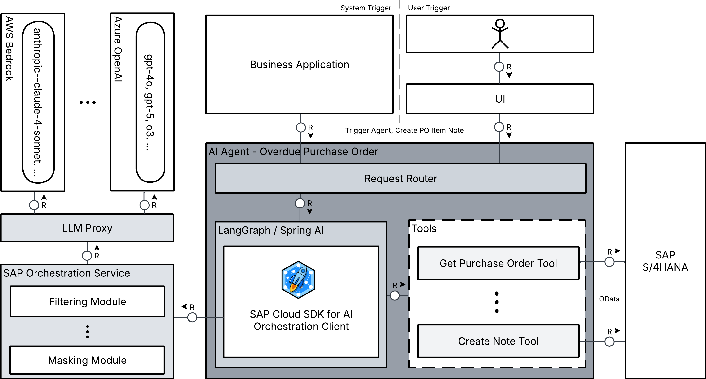

> [!CAUTION]
> Access to test systems are considered temporal.
> However, in all cases you can still use the sample code and tutorial available in this repository.
> 
> If you are part of a workshop session, the credentials will be shared with you.

# AI160 - Build Your Own AI Agent-Based Solution with the Generative AI Hub

## Description

This repository contains material for multiple sessions:
- SAP TechEd 2025 ["AI160 - Build Your Own AI Agent-Based Solution with the Generative AI Hub"](https://www.sap.com/events/teched/berlin/flow/sap/te25/catalog-inperson/page/catalog/session/1749827524991001reiY).

## Overview

This session introduces attendees on building AI agent-based solutions using the [SAP AI Core SDKs](https://help.sap.com/docs/sap-ai-core/sap-ai-core-service-guide/libraries-and-sdks) and the [Generative AI Hub](https://help.sap.com/docs/sap-ai-core/sap-ai-core-service-guide/generative-ai-hub-in-sap-ai-core) in AI Foundation.

This session offers two parallel tracks:
- [SAP Cloud SDK for AI (JavaScript)](exercises/javascript/README.md)
- [SAP Cloud SDK for AI (Java)](exercises/java/README.md)

Both tracks cover identical core concepts and practical applications, differing only in the programming language and SDK utilized.
You may choose the track that best aligns with your technology stack.
You may also opt to experience multiple tracks to broaden your understanding.

## Getting Started

1. **Clone the Repository**:
    
    Clone the repository using your preferred Git client.
    If you’re using the Git command line interface, run the following command:
    ```bash
    git clone https://github.com/SAP-samples/teched2025-AI160.git
    ```
2. **Select Your Programming Language**: 
    - Choose between [JavaScript](exercises/javascript/README.md) or [Java](exercises/java/README.md) by clicking the respective links.

Please note:

* If you have your own AI Core instances for consuming Generative AI Hub capabilities, you can follow this tutorial using those instances.
  Please make the following adjustments:
    * You need to create a deployment for orchestration by referring the [documentation](https://help.sap.com/docs/sap-ai-core/sap-ai-core-service-guide/create-deployment-for-orchestration?locale=en-US).
    * Before beginning the exercises, you’ll need to provide system information.
    Instead of using the hands-on test system provided for this tutorial, use your own AI Core instance details, such as the AI Core client ID, secret, and authentication URL.
    * If you’re running your application on BTP rather than locally, the SDKs will automatically retrieve your AI Core instance information from the VCAP_SERVICES environment variable. 


## Demo Application

An AI-powered Purchase Order (PO) Management Agent that identifies overdue PO items and automates escalation workflows.

### Architecture

The application demonstrates an AI agent workflow that orchestrates multiple specialized tools to process natural language queries about purchase order items.
Available in both JavaScript ([LangGraph]((https://langchain-ai.github.io/langgraph/))) and Java (Spring AI) implementations.

### Core Integration Points

- **SAP S/4HANA**: Purchase Order API for real-time PO data retrieval and note creation
- **SAP AI Core Orchestration Service**: Handles LLM invocation, content filtering, and data masking
- **Agent Framework**: LangGraph (JS) or Spring AI (Java) for workflow orchestration and tool routing

Users interact through a React frontend, submitting natural language queries like "Show overdue PO items for plant DE01".
The agent intelligently routes through specialized tools — fetching PO data, calculating overdue status, formatting responses, and creating escalation notes.



## Contributing
Please read the [CONTRIBUTING.md](./CONTRIBUTING.md) to understand the contribution guidelines.

## Code of Conduct
Please read the [SAP Open Source Code of Conduct](https://github.com/SAP-samples/.github/blob/main/CODE_OF_CONDUCT.md).

## How to obtain support

Support for the content in this repository is available during the actual time of the online session for which this content has been designed. Otherwise, you may request support via the [Issues](../../issues) tab.

## License
Copyright (c) 2024 SAP SE or an SAP affiliate company. All rights reserved. This project is licensed under the Apache Software License, version 2.0 except as noted otherwise in the [LICENSE](LICENSES/Apache-2.0.txt) file.
