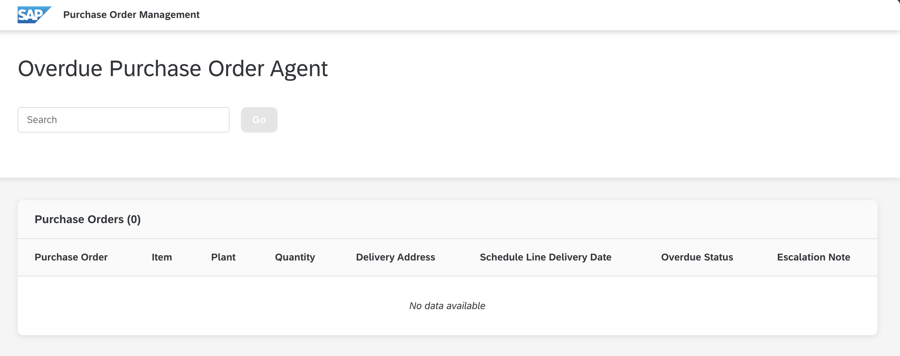

# Preparation

By completing these steps, you will have the Express and React -based  web applications up and running.

### Prerequisites:

The test system access details are pre-filled in the [.env](../app/agent/.env), in the below format. 
```
AICORE_SERVICE_KEY='{"clientid": "<demo_credentials_clientid>","clientsecret": "<demo_credentials_clientsecret>","url": "<demo_credentials_url>","serviceurls": {"AI_API_URL": "<demo_credentials_serviceurls_AI_API_URL>"}}'
```

### 1. Navigate to the Application Directory:

Assuming you are still in the root directory of the teched2025-AI160 repository, navigate to the app folder:

```bash
cd exercises/javascript/app
```

### 2. Install Dependencies:

Install the required dependencies using:

```bash
npm ci
```

> [!NOTE]
> `npm ci` installs dependencies as per `package-lock.json`, ensuring consistency.


### 3. Start the Application:

Run the following to start all applications (mock-server, agent, and UI):

```bash
npm run tutorial
```

> [!NOTE]
> This command starts the mock-server (port `3000`), agent (port `3001`), and UI (port `3002`) using concurrently.

### 4. Verify the Application is Running:

After a few seconds, you should see log messages similar to:

```bash
[ui] Local: http://localhost:3002/
[mock-server] [2025-09-29T14:27:42.575Z] INFO     (server): Mock server started on port 3000
[agent] [2025-09-29T14:27:42.980Z] INFO     (server): AI Agent server started on port 3001
```

### 6. Access the Application:

Open your browser and visit http://localhost:3002/.
You should see the Purchase Order Management interface is loaded.



The agent is not yet configured to process any purchase orders - hence the message "No data available" is shown.
You'll implement this functionality in the following exercises.

### Troubleshooting:

If you encounter errors, try checking if the respective ports are in use:

   ```shell
   lsof -i :3000
   lsof -i :3001
   lsof -i :3002
   ```

## Summary 

**Congratulations!**

Your application is up and running.
In the following exercises, you'll implement the core functionality step by step.

Continue to [Exercise 1 - Working with Overdue PO Items: Configure Tools and LangGraph Agent](../ex1/README.md).
