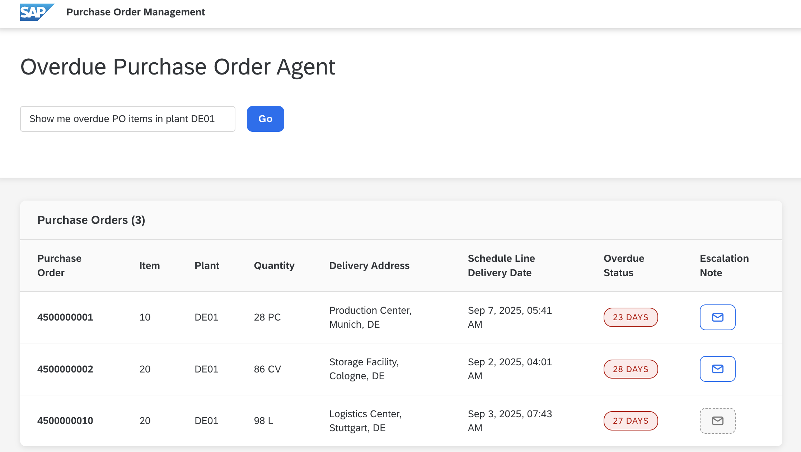

# Exercise 1 - Working with Overdue PO Items: Configure Tools and LangGraph Agent

In this exercise, you will implement an AI agent that works with Purchase Order (PO) API using specialized tools.
You'll learn how to build agents with [SAP Cloud SDK for AI(JavaScript)](https://github.com/SAP/ai-sdk-js) (`@sap-ai-sdk/langchain`) and [LangGraph](https://langchain-ai.github.io/langgraphjs/).

## Overview

In this task, you will configure an AI agent to fetch PO items from an S/4HANA system and analyze which items are overdue.
For this, you will enable the following tools:

1. `getPurchaseOrderItemsTool` - Fetches PO items from an S/4HANA system
2. `calculateOverdueTool` - Calculates if delivery dates are overdue
3. `formatPurchaseOrdersTool` - Formats the final output

## Step 1: Understanding the Agent's Current State

Open [app/agent/src/po-agent.ts](../../javascript/app/agent/src/po-agent.ts) and examine the system prompt in the `startPurchaseOrderAgent()` function.

The system prompt defines the agent's core capability:

```markdown
You are an assistant for identifying overdue Purchase Order (PO) items and managing escalations.

**Core Tasks:**

1. Analyze overdue PO items
2. Draft an escalation email

## Analyze overdue PO items

**Process:**

1. Get PO items by calling the 'get_purchase_order_items' tool and filter the items based on the user prompt.
  - If you cannot apply the user input precisely to filter tool, then just get as many PO items as you can which matches the criterion.
  - Once you get all relevant PO items from the tool, filter the items again based on the user input by checking the content WITHOUT calling the tool.
  - Make sure you respect the user input and only return items that are asked by user.
  - For example, when user asks PO items to south germany, then you can call the tool with country filter 'DE' first, then filter the result again by checking city names if they are located in south Germany.
2. For each item, calculate if overdue by comparing delivery date to current date using 'calculate_overdue' tool. If the value is negative, the item is overdue.
3. Discard non-overdue items from further processing and return final result.

Always call the 'format_response_purchase_orders' tool to format PO items into a pure JSON in the final response.
```

The prompt outlines a multi-step workflow that requires multiple tools working together.
Based on user query, the agent needs to fetch data, apply business logic, and format results.

However, these tools are not available to the model yet.
Notice that the tools array is empty:

```typescript
const tools: [] = [
    // getPurchaseOrderItemsTool,
    // calculateOverdueTool,
    // formatPurchaseOrdersTool,
    // createNoteTool
];
```

## Step 2: Enable the Required Tools

Before enabling the tools, let's understand their implementation.

### 1. **Get Purchase Order Items**
Open [app/agent/src/tools/get-purchase-order-item.ts](../../javascript/app/agent/src/tools/get-purchase-order-item.ts) and study the implementation.
The `getPurchaseOrderItemsTool` tool is designed to fetch Purchase Order items from the SAP S/4HANA database and has filtering capabilities for plant, city, and country.

The underlying `fetchPurchaseOrderItems()` function called by the tool handles OData queries and returns data including delivery schedules and notes.

Type or uncomment the following code within the `getPurchaseOrderItemsTool()` function body and save the file:

```typescript
async ({
    plant,
    deliverAddressCityName,
    deliverAddressCountry
}: SearchParams) => {
    return fetchPurchaseOrderItems(
        plant,
        deliverAddressCityName,
        deliverAddressCountry
    );
}
```

### 2. **Calculate Overdue Status**

Next, open [app/agent/src/tools/calculate-overdue.ts](../../app/agent/src/tools/calculate-overdue.ts) and examine the tool logic.

This utility tool processes SAP timestamp format `/Date(1234567890123)/` and compares delivery dates with current time.
It returns millisecond difference where positive values indicate future dates (not overdue) and negative values indicate past dates (overdue).

### 3. **Format Purchase Orders**

Open [app/agent/src/tools/format-response.ts](../../javascript/app/agent/src/tools/format-response.ts) and review the formatting logic.
This tool takes a list of PO items and formats them into a structure expected by the frontend.


Now enable the required tools in the Agent.
In the [app/agent/src/po-agent.ts](../../javascript/app/agent/src/po-agent.ts), navigate to the tools array and add the three tools needed for this exercise:

```typescript
const tools = [
    getPurchaseOrderItemsTool,
    calculateOverdueTool,
    formatPurchaseOrdersTool
];
```

> Note
> The `createNoteTool` is not needed for this exercise, so leave it commented out.

## Step 3: Initialize the Orchestration LangChain Client

You need to instantiate the chat model to be able to connect with AI Core and get access to the deployed `gpt-4o` model. 
Type or uncomment the following code snippet:

```typescript
const model = new OrchestrationClient({
    promptTemplating: {
        model: {
            name: 'gpt-4o'
        }
    }
}, { maxRetries: 0 });

const modelWithTools = model.bindTools(tools);
```

Calling `.bindTools(tools)` makes sure the model knows that it has these tools available to call. 

Next, define the function that calls this model.
Navigate to the `callModel()` function and update it to use the `modelWithTools` instance:

```typescript
async function callModel({ messages }: typeof MessagesAnnotation.State) {
    const response = await modelWithTools.invoke(messages);
    return { messages: [response] };
}
```


## Step 4: Bring It All Together

Now that you have enabled the tools and configured the model, let's look at how LangGraph ties them together.

```typescript
const workflow = new StateGraph(MessagesAnnotation)
    .addNode('agent', callModel)
    .addNode('tools', toolNode)
    .addConditionalEdges('agent', shouldContinueAgent, ['tools', END])
    .addEdge('tools', 'agent')
    .addEdge(START, 'agent'); 
```

This graph shows how the workflow moves between the `agent` (model) and its `tools`.
The entrypoint is the `agent`, linked from the special `START` node.
The `agent` generates a response, then `shouldContinueAgent()` function decides whether to call `tools` or `END` the process.
If tools are called, they run their task and return control to the `agent` to decide what to do next.
When the workflow reaches `END`, the final LLM response is returned.


## Step 5: Test the Complete Workflow

Save your changes and wait for the application to restart automatically.

Navigate to http://localhost:3002/ and test the overdue detection:

1. In the input field, enter: `Show me overdue PO items in plant DE01`
2. Click the **Go** button

You should see the table populate with overdue PO items from plant `DE01`.



Click on the email icon to view the escalation email draft generated by the LLM.
It will read something like this:

```plaintext
Subject: Escalation: Overdue Purchase Order 4500000002 - Item 20

Dear Administrator,

The following purchase order item 20 is overdue for delivery.
Quantity: 86 CV.
Delivery Address: Storage Facility, Cologne (Plant DE01).
This delay is impacting downstream operations and replenishment plans.
Please address this issue promptly.

Please contact us via the email info@example.com if urgent.
```

PO items without existing notes will display a **Send** button, but it won't work yet since the `createNoteTool` isn't enabled.
You'll implement note creation in the next exercise.

## Step 6: Understanding the Agent Workflow

So what happened under the hood?
When you clicked **Go**, your input was sent as a human message to the LLM, along with the system prompt and a reference to the available tools.
The LLM then determined that it needed to use the tools to query the S/4HANA database, retrieve all PO items, and identify the overdue ones.
Finally, it formatted the results and returned the response back to the frontend.

### Viewing Tool Calls in Detail

To see exactly how the LLM selected the tools, you can enable detailed tool call logging.
In [app/agent/src/po-agent.ts](../../javascript/app/agent/src/po-agent.ts), uncomment the following lines in the `shouldContinueAgent()` function:

```typescript
if (lastMessage.tool_calls?.length) {
    console.log('Tool calls:', lastMessage.tool_calls);
}
```
Now repeat [Step 5](#step-5-test-the-complete-workflow).
The terminal logs will show how the agent follows its system prompt instructions and which tools the LLM chooses:

```bash
[agent] Request: GET /api/agent/trigger-agent?prompt=Show me overdue PO items in plant DE01
[agent] Tool calls: [
[agent]   {
[agent]     id: 'call_u9JEjwKerX2m1BE353mo3DRY',
[agent]     name: 'get_purchase_order_items',
[agent]     args: { plant: 'DE01' },
[agent]     type: 'tool_call'
[agent]   }
[agent] ]
[mock-server] GET (server): Request: GET /sap/opu/odata/sap/API_PURCHASEORDER_PROCESS_SRV/A_PurchaseOrderItem?%24filter=Plant+eq+%27DE01%27&%24expand=to_ScheduleLine%2Cto_PurchaseOrderItemNote
[agent] Tool calls: [
[agent]   {
[agent]     id: 'call_pFrBRaEvJLya3ENxxpuLn8kB',
[agent]     name: 'calculate_overdue',
[agent]     args: { sapTimestamp: '/Date(1757216514641)/' },
[agent]     type: 'tool_call'
[agent]   },
[agent]   ...
[agent]   ... # more calls to calculate_overdue for each PO item
[agent]   ]
[agent] Tool calls: [
[agent]   {
[agent]     id: 'call_GU7mJApw0qXVkmKleYCh84UC',
[agent]     name: 'format_response_purchase_orders',
[agent]     args: { data: [Array] },
[agent]     type: 'tool_call'
[agent]   }
[agent] ]
```

## Step 7: Test Different Scenarios

Try these queries to see how the agent interprets its prompt and uses tools:

- `What PO items are overdue in Berlin?`
- `Show me overdue items being delivered to Munich`

In each of these calls, the AI agent will filter the PO items after it received all items from the S/4 system.

## Summary

You have successfully built an AI agent using the SAP Cloud SDK for AI and LangGraph.
You have also tested the integration with the S/4HANA system to fetch data.

Continue to [Exercise 2 - Escalating overdue Items: Writing Data to S/4](../ex2/README.md) to extend the agent's capabilities to write data to the S/4 system.
